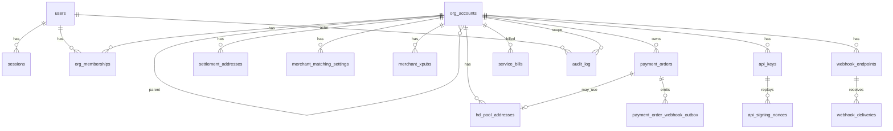

# M4-35 — Database schema reference

**Owner:** Kevin (doc). **Source of truth:** `apps/api/migrations/*.sql` (Andrew).  
**Conventions:** [DB-Conventions.md](DB-Conventions.md). **Domain enums:** `packages/domain`.

Phase 1 Postgres schema for CryptoGate. Watcher reads/writes **payment order** chain columns; it does **not** run migrations.

**Latest migration:** `018_service_bill_lifecycle_audit.sql` (run `pnpm --filter @cryptogate/api migrate` before deploy).

**018 before 017 on fresh env:** migrations apply in filename order; **017** then **018** on existing DBs that already ran through 017.

---

## 1. Entity overview

---

## 2. Table catalog

### Auth & users

| Table | Purpose | Key columns |
| --- | --- | --- |
| `users` | Login identity | `email`, `password_hash`, `mfa_secret`, `mfa_enrolled_at` |
| `sessions` | Server sessions (`cg_session`) | `user_id`, `token_hash`, `expires_at`, `revoked_at`, `mfa_verified_at` |

### Org tree

| Table | Purpose | Key columns |
| --- | --- | --- |
| `org_accounts` | Platform → agent → merchant tree | `type`, `parent_id`, `structure`, `max_agent_depth` (platform row) |
| `org_memberships` | User role in an org | `org_id`, `user_id`, `role` (Owner / Administrator / Viewer / Cashier) |

### Payment orders (merchant collection)

| Table | Purpose | Key columns |
| --- | --- | --- |
| `payment_orders` | Payer → merchant address orders | `status`, `matching_mode`, `payable_amount`, `receive_address`, `tx_hash`, `confirmations`, `expires_at` |
| `merchant_matching_settings` | Default mode B/C/D/S per merchant | `org_id`, `matching_mode` |
| `settlement_addresses` | Mode B main address + cool-down | `address`, `pending_address`, `pending_activates_at` |
| `merchant_xpubs` | Mode S watch-only xPub | `xpub`, `asset`, `network` |
| `hd_pool_addresses` | Mode S pool slots | `status` (`FREE`/`IN_USE`/`COOLDOWN`), `hd_index`, `cooldown_until` |

**Order `status` values:** `pending_payment`, `verifying`, `confirmed`, `completed`, `expired`, `payment_anomaly`, `failed`, `cancelled` — must match `@cryptogate/domain` and [Watcher-Order-Status-Contract.md](Watcher-Order-Status-Contract.md).

### Integrations

| Table | Purpose | Key columns |
| --- | --- | --- |
| `api_keys` | HMAC machine auth | `key_id`, `secret` (never log), `label`, `revoked_at`, `expires_at` |
| `api_signing_nonces` | Replay prevention | `api_key_id`, `nonce`, `expires_at` |
| `webhook_endpoints` | Merchant callback URLs | `url`, `events`, `signing_secret`, `enabled` |
| `webhook_deliveries` | Outbound POST attempts | `status` (`pending`/`success`/`failed`), `attempt`, `next_retry_at` |
| `payment_order_webhook_outbox` | DB trigger → fan-out queue | `event_type`, `processed_at` |

### Platform billing (separate rail)

| Table | Purpose | Key columns |
| --- | --- | --- |
| `service_bills` | Subscription + volume fee | `subscription_amount`, `volume_fee_amount`, `status`, `due_at`, `paid_at`, `voided_at`, `last_adjustment_reason`, `payment_reference` |

### Audit

| Table | Purpose | Key columns |
| --- | --- | --- |
| `audit_log` | Append-only privileged actions | `actor_user_id`, `org_id`, `action`, `metadata` — **no UPDATE/DELETE** (trigger); index `(action, created_at DESC)` from **018** |

### Schema meta

| Table | Purpose |
| --- | --- |
| `schema_migrations` | Applied migration id + checksum (`apps/api/scripts/migrate.mjs`) |

---

## 3. Migration index

| File | Milestone | Adds |
| --- | --- | --- |
| `001_users_sessions.sql` | M1-10 | `users`, `sessions`, `pgcrypto` |
| `002_user_mfa.sql` | M1-12 | MFA columns on `users`, `sessions` |
| `003_org_accounts.sql` | M1-13 | `org_accounts` |
| `004_org_memberships.sql` | M1-15 | `org_memberships` |
| `005_payment_orders.sql` | M1-19 / M2 | `payment_orders` |
| `006_settlement_addresses.sql` | M2 | `settlement_addresses` |
| `007_merchant_matching_settings.sql` | M2 | `merchant_matching_settings` |
| `008_audit_log.sql` | M1-17 | `audit_log` + immutability trigger |
| `009_settlement_cooldown.sql` | M2-16 | pending address cool-down columns |
| `010_merchant_xpubs.sql` | M2 | `merchant_xpubs` |
| `011_hd_pool_addresses.sql` | M2-44 | Mode S pool |
| `012_api_keys.sql` | M3-10 | `api_keys`, `api_signing_nonces` |
| `013_webhooks.sql` | M3-13 | `webhook_endpoints`, `webhook_deliveries` |
| `014_webhook_delivery_body.sql` | M3-14 | `body_raw` on deliveries |
| `015_service_bills.sql` | M3-16 | `service_bills` |
| `016_payment_order_webhook_outbox.sql` | M3-14 | outbox + order triggers |
| `017_api_keys_mgmt.sql` | M4-11 | `label`, `last_used_at`, `expires_at` on `api_keys` |
| `018_service_bill_lifecycle_audit.sql` | M4-36 | `paid_at`, `voided_at`, `last_adjustment_reason`, `payment_reference` on `service_bills`; audit action index |

**Pending (X-01 / v0.3.3):** Andrew migration **019** — `platform_fee_tiers`, `merchant_commercial`, `enterprise_rate_approvals` (see [X-01-Fee-Tiers-v033.md](X-01-Fee-Tiers-v033.md)).

---

## 4. Watcher boundaries

| Watcher may update | API owns |
| --- | --- |
| `payment_orders.status`, `tx_hash`, `received_amount`, `confirmations` | All DDL / migrations |
| Read open orders for match + confirm | Webhook fan-out worker, expiry job |

New order columns require **Andrew migration PR** + **Bruce watcher review** per [DB-Conventions.md](DB-Conventions.md).

---

## 5. Sensitive columns (never log)

- `users.password_hash`, `mfa_secret`, `mfa_pending_secret`
- `sessions.token_hash`
- `api_keys.secret`
- `webhook_endpoints.signing_secret`
- `merchant_xpubs.xpub` (treat as sensitive config)

See [M4-02-Secrets-TLS.md](M4-02-Secrets-TLS.md).

---

## 6. Handoff status

| Deliverable | Status |
| --- | --- |
| Table catalog + ERD (this doc) | **Done** |
| Formal ERD diagram (draw.io) | Optional — Company A / Andrew |
| Auto-generated DDL dump | Use `pg_dump --schema-only` on deployed env |

---

## Related

- Ops index: [M4-33-Ops-Runbook-Index.md](M4-33-Ops-Runbook-Index.md)  
- Backup: [M4-03-Backup-Monitoring.md](M4-03-Backup-Monitoring.md)  
- OpenAPI shapes: `packages/api-spec/openapi.yaml`
