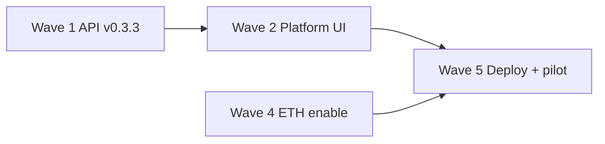

# Phase 1 — Solo implementation plan

**Replaces:** `TEAM-BOARD.md` (removed). **Authority:** [Phase1-Project-Plan.md](Phase1-Project-Plan.md), [Phase1-Requirement.md](Phase1-Requirement.md), [Business-Model.md](Business-Model.md).  
**Contract:** OpenAPI **v0.3.3** · [CONTRACT-FREEZE.md](CONTRACT-FREEZE.md)  
**Design:** [Figma — Design System](https://www.figma.com/design/VjnnzGqWIo1q2aLRLdA89p/Untitled?node-id=14-2) (canvas `00 Design System`, node `14:2`) · [UI-Handoff.md](UI-Handoff.md) · [UI-Style-Lock.md](UI-Style-Lock.md)

Single-threaded plan to finish CryptoGate Phase 1 without multi-developer coordination. Work top-to-bottom within each wave; do not start a later wave until its **Gate** passes.

---

## 1. Current state (2026-08-24)

### Done — core rail

| Area | Status | Evidence |
| --- | --- | --- |
| Domain + OpenAPI | v0.3.3 frozen | `packages/domain`, `packages/api-spec` |
| API (auth, orgs, orders, settlement, xPub, HD pool, keys, webhooks, bills, audit) | Implemented | `apps/api`, migrations **001–018** |
| Matching B/C/D/S | Complete | `packages/matching`, §2.8 CI |
| Watcher (Tron + Ethereum client) | Complete | `apps/watcher`, `packages/chain-clients` |
| Merchant web D1–D17 | Complete | `apps/web/src/merchant` |
| Platform shell (agents, merchants, bills, audit page) | Partial | `apps/web/src/platform` — commercial **stubs** |
| Agent portal C* | Partial | `apps/web/src/agent` — onboard commercial **stubs** |
| Guest pay page | Live poll + demo states | `apps/payment-page` |
| Cashier APK (generic Android) | Login, create, QR, poll | `apps/cashier-apk` |
| Ops docs + E2E smoke | Done | `doc/M4-*`, `scripts/e2e-smoke.mjs` |

### Live networks

| Pair | Registry | Ingest |
| --- | --- | --- |
| USDT / tron | **enabled** | Live (TronGrid) |
| USDT / ethereum | `enabled: false` | Client ready — flip after [M3-32-Ethereum-Go-Live.md](M3-32-Ethereum-Go-Live.md) |
| Other Plan §VI pairs (13) | `enabled: false` | Catalogued in `ASSET_NETWORK_REGISTRY` — enable after each chain-client smoke |

Full list: [M3-04-Asset-Networks.md](M3-04-Asset-Networks.md).

### Largest code gap

**OpenAPI v0.3.3 platform/commercial paths have no API implementation** — UI wizards and tier sliders are stub-only. Blocks real agent onboard, B8 fee tiers, and enterprise approval flow.

---

## 2. Design system (Figma)

Source: [Design System canvas](https://www.figma.com/design/VjnnzGqWIo1q2aLRLdA89p/Untitled?node-id=14-2) — **Foundation v1.0**, Institutional Ink.

| Token (Figma) | Hex | Already in code |
| --- | --- | --- |
| `bg/base` | `#0B0F14` | payment-page, web dark theme |
| `bg/card` | `#12181F` | payment-page `--surface` |
| `border/subtle` | `#1E2A36` | payment-page `--border` |
| `border/focus` / accent | `#00D4C8` | `--accent` |
| Typography | Outfit + mono (IBM Plex Mono in pay page) | Partial — web uses mixed stack |

**Wave 7 (polish):** Extract tokens into `apps/web` CSS variables from Figma §01; align components (buttons, inputs, status pills) from Figma §02 before net-new screens.

---

## 3. Implementation waves

### Wave 1 — Platform & commercial API (blocks everything commercial)

**Goal:** Replace all fee/tier/commercial UI stubs with real persistence.

| # | Task | Files / notes |
| --- | --- | --- |
| 1.1 | Migration **019**: `platform_fee_tiers`, `merchant_commercial`, `enterprise_rate_approvals` | `apps/api/migrations/` per [X-01-Fee-Tiers-v033.md](X-01-Fee-Tiers-v033.md) |
| 1.2 | Seed tiers from `DEFAULT_FEE_TIER_BANDS` | migrate script or SQL seed |
| 1.3 | `GET/PUT /platform/settings/fee-tiers` | Platform Owner PUT; audit `fee_tier_put` |
| 1.4 | `GET/PUT /platform/settings/org-policy` | `max_agent_depth` on platform org row |
| 1.5 | `GET/PUT /orgs/{orgId}/commercial` | Agent/platform assign within band |
| 1.6 | Enterprise approval queue + PATCH decide | Platform Owner only |
| 1.7 | `POST /orgs` accepts `commercial` for merchant create | Wire agent C6 wizard |
| 1.8 | Tests: rules, authz, band validation, 403 Cashier | `apps/api/test/` |
| 1.9 | Update [M4-35-Database-Schema.md](M4-35-Database-Schema.md) for **019** | |

**Gate:** Agent onboard sends real commercial payload; platform can edit B8 tiers; CI green.

---

### Wave 2 — Platform & agent UI wiring

**Goal:** Remove stub labels; route missing platform pages.

| # | Task | Route / file |
| --- | --- | --- |
| 2.1 | Fee tiers settings page (B8) | `/platform/settings/fee-tiers` → `PlatformApp.tsx` |
| 2.2 | Global org policy (B13) | `/platform/settings` or `/platform/settings/org-policy` |
| 2.3 | Wire onboard wizards to API | `OnboardAgentPage`, `OnboardMerchantPage` |
| 2.4 | Enterprise approval table (B8 sub-table) | platform settings |
| 2.5 | Service bill PATCH UI (B9/B10) | already on API v0.3.2 — wire forms |
| 2.6 | Audit log filters polish (B14) | `AuditLogPage.tsx` |
| 2.7 | `GET /orgs/{orgId}/users` list + team settings | [UI spec](UI-Page-Spec.md) team pages |

**Gate:** Platform operator can set tiers, onboard agent+merchant with real rates, issue/adjust bill, review audit.

---

### Wave 3 — Auth & MFA UX

| # | Task | Notes |
| --- | --- | --- |
| 3.1 | MFA enroll + verify screens (web) | API exists; portals throw on `mfaRequired` today |
| 3.2 | Session refresh / logout regression | M1-T03 acceptance |
| 3.3 | Cashier/APK MFA block message | Already present — verify copy |

**Gate:** Owner enrolls MFA on web; login completes with TOTP.

---

### Wave 4 — Second network go-live

Follow [M3-32-Ethereum-Go-Live.md](M3-32-Ethereum-Go-Live.md).

| # | Task |
| --- | --- |
| 4.1 | Staging: `ETH_RPC_URL`, create USDT/ethereum order (422 until enable) |
| 4.2 | End-to-end: test wallet → verifying → completed @ 12 conf |
| 4.3 | Kevin PR: `USDT_ETHEREUM.enabled: true` + M3-04 live section |
| 4.4 | `E2E_API_BASE=… node scripts/e2e-smoke.mjs --live` on staging |

**Gate:** Staging accepts USDT/ethereum orders; guest pay shows Ethereum ERC-20 label.

---

### Wave 5 — Deploy, handoff, acceptance

| # | Task | Doc |
| --- | --- | --- |
| 5.1 | Company A test env deploy | [M3-T09-Company-A-Handoff.md](M3-T09-Company-A-Handoff.md) |
| 5.2 | Restore drill execute + sign-off | [M4-T04-Restore-Drill-Report.md](M4-T04-Restore-Drill-Report.md) |
| 5.3 | M1-T05 prototype walkthrough | [M1-T05-Demo-Script.md](M1-T05-Demo-Script.md) |
| 5.4 | M3 acceptance T01/T09/T10 spot-check on staging | [M3-Acceptance.md](M3-Acceptance.md) |
| 5.5 | M4-T01 functional regression checklist | [Phase1-Requirement.md](Phase1-Requirement.md) §V |
| 5.6 | M4-T04 CVE: `pnpm audit` + record | M4-T04 §4 |
| 5.7 | M4-40 pilot merchant selection | **Client** |
| 5.8 | M4-T05 pen test | **External** |

**Gate:** Test env live; restore drill filed; pilot merchant agreed.

---

### Wave 6 — Cross-milestone backlog

| ID | Task | After |
| --- | --- | --- |
| X-02 | Service bill **generation** automation (not just manual issue) | Wave 2 |
| X-03 | Agent commission statements (read-only) | Wave 1 |
| X-04 | Merchant (site) inherit + Owner approval for overrides | Wave 2 |
| X-06 | Next network (BSC USDT) | Wave 4 |
| X-07 | E2E: signed order create + webhook listener tier | Wave 5 |

---

### Wave 7 — M5 POS hardware (client-dependent)

Blocked on [M5-01-Reference-Device.md](M5-01-Reference-Device.md) sign-off.

| # | Task |
| --- | --- |
| 7.1 | OEM printer SDK integration (M5-02) |
| 7.2 | Customer display / second screen (M5-03) |
| 7.3 | Receipt on Completed (M5-T02) |
| 7.4 | Reference device retest |

**Fallback (M5-T05):** Generic APK + screen QR accepted until SKU supplied.

---

### Wave 8 — Design polish & motion

| # | Task |
| --- | --- |
| 8.1 | Sync CSS tokens from Figma `01 — Tokens` into `apps/web` |
| 8.2 | Payment page motion pass (Figma page 99) — respect `prefers-reduced-motion` |
| 8.3 | Component library alignment (Figma `02 — Components`) |
| 8.4 | README refresh (v0.3.3, web implemented) |

---

## 4. Critical path (shortest path to UAT)



Parallel safe: Wave 3 (MFA UI), Wave 8 (tokens), docs — **do not** change OpenAPI/domain during Wave 1 without updating freeze doc.

---

## 5. Daily ritual (solo)

```bash
git pull origin main
node scripts/check.mjs          # or: pnpm run e2e:check
# pick next unchecked item in current wave
```

Update **§6 Status** below when a wave gate passes. No separate board file.

---

## 6. Status tracker

| Wave | Gate | Status |
| --- | --- | --- |
| 0 Core rail | CI + matching §2.8 | **Done** |
| 1 Platform API | Commercial persist + tests | **Done** |
| 2 Platform UI | B8/B13/B4/C6 wired | **Done** |
| 3 MFA UX | Enroll + login | **Done** |
| 4 Ethereum | Staging smoke + enable | **Todo** (client ready) |
| 5 Deploy/UAT | M3-T09 + M4-T04 + pilot | **Local deploy ready** — Company A hostnames pending |
| 6 X-backlog | Per ID | **Scheduled** |
| 7 M5 hardware | Reference device | **Blocked** (client) |
| 8 Design polish | Token sync | **Optional** |

### Client blockers (cannot code around)

| ID | Need |
| --- | --- |
| M1-01 | Written scope sign-off |
| M3-T09 §3 | Company A hostname / TLS / DB table |
| M4-40 | Pilot merchant selection |
| M5-01 | Reference POS device in writing |

---

## 7. Test commands

| Command | Purpose |
| --- | --- |
| `node scripts/deploy-wave5.mjs` | Wave 5 local deploy (postgres + migrate + API + watcher + smoke) |
| `docker compose -f docker-compose.deploy.yml up -d` | Containerized API + watcher + Postgres |
| `node scripts/check.mjs` | Full contract gate (CI) |
| `pnpm run e2e` | Signing + webhook samples |
| `pnpm run e2e:check` | E2E + check.mjs |
| `node scripts/demo-walkthrough.mjs` | M1-T05 demo URLs |
| `DATABASE_URL=… node apps/api/scripts/load-m4-12.mjs --http` | Load smoke |

---

## 8. Invariants (never violate)

From [ARCHITECTURE.md](ARCHITECTURE.md):

1. Watch-only — no merchant spend keys on platform.
2. Volume fee not deducted from payer on-chain payment.
3. Cashier cannot change settlement, xPub, matching mode, fees.
4. Agents do not create merchant payment orders.
5. Mode B same-amount collision → anomaly, not FIFO.
6. Mode S never signs or sweeps.
7. Webhooks signed; no fulfill on browser redirect alone.

---

## Related

- Task IDs: [Milestone-Task-List.md](Milestone-Task-List.md)  
- Ops: [M4-33-Ops-Runbook-Index.md](M4-33-Ops-Runbook-Index.md)  
- Integration: [M3-02-Integration-Guide.md](M3-02-Integration-Guide.md)
