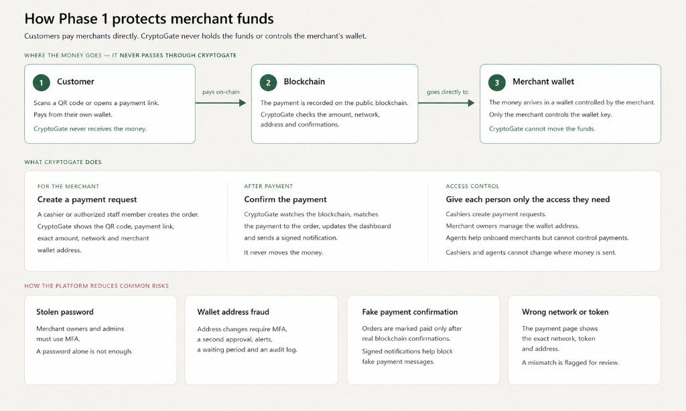

This document is the Phase 1 project plan. Product scope, non-custodial rules, deliverables, and testing obligations already stated in [Phase 1 Requirement](Phase1-Requirement.md) are not repeated here.

## I. System Architecture

The money never passes through PaymentGate. The customer scans a QR code or opens a payment link and pays from their own wallet. The payment is recorded on the public blockchain. PaymentGate checks the amount, the network, the address and the confirmations. The money arrives in a wallet the merchant controls. Only the merchant has the key. PaymentGate cannot move the funds.

What PaymentGate does is software. A cashier or authorized staff member creates the order — from the merchant backend, the API, or the **cashier Android POS app** (Section III). We show the QR code, the payment link, the exact amount, the network and the merchant wallet address. After payment we watch the chain, match it to the order, update the dashboard and send a signed notification. We still never move the money.

Each person gets only the access they need. Cashiers create payment orders. Merchant Owners manage the wallet address. Agent accounts onboard merchants but cannot control payer payments. Cashiers and agent-account users cannot change where money is sent.

Org account types and user roles are defined in [Business-Model.md](Business-Model.md) Terminology.

The usual risks are handled in the same spirit. Merchant Owners and Administrators must use MFA — a password alone is not enough. A wallet address change needs MFA, a second approval, an alert, a waiting period and an audit log. An order is marked paid only after real blockchain confirmations; signed notifications help block fake payment messages. The payment page shows the exact network, token and address. A mismatch is flagged for review, not marked paid.

Phase 1 defaults to a **fixed merchant settlement address**. Merchants may enable other matching modes — including **Smart address (Mode S)**, which uses watch-only xPub derivation only when same-amount collisions would otherwise occur. See Section II. PaymentGate never holds private keys and never sweeps funds on the merchant’s behalf in Phase 1.

## II. Payment Matching Modes

PaymentGate never learns the Cashier from the blockchain. Cashier, location and order id live in the order record. The chain only shows destination, asset, network, amount, time and transaction hash. With one shared settlement address, two open orders for the same amount can look identical on-chain. Phase 1 therefore offers merchant-selectable matching modes.

### 2.1 Modes available in Phase 1

The merchant Owner (not Cashier) chooses a matching mode in the merchant portal. The mode in force when an order is **created** is stored on that order and used for matching until the order is closed. Changing the merchant’s default mode does not rewrite open orders.

| Mode | Code | Phase | Description |
| --- | --- | --- | --- |
| Standard (recommended default) | B | 1 | Fixed address + strict match rules |
| Amount fingerprint | C | 1 | Slight amount uniqueness on top of B |
| Memo / destination tag | D | 1 | Memo or tag on top of B, only where the network supports it |
| Smart address | S | 1 | Main address unless same-amount conflict; then HD address from xPub pool |
| Unique address per order | A | 2 | Always unique HD address per order + merchant sweep UX — not Phase 1 |

For Modes B, C and D, base layer **B always applies**. Mode S replaces collision handling with on-demand unique receive addresses (still non-custodial watch-only). Do not combine Mode S with Mode C on the same order path (both solve collision differently); validation rejects conflicting combinations.

### 2.2 Mode B — Fixed address + strict match (default)

Funds always go to the merchant’s configured settlement address for that asset and network.

Match an incoming transaction to an open order only when all of the following agree:

1. Destination address  
2. Virtual asset and network (and token contract where applicable)  
3. Payable amount (exact, subject to any underpay rule that does not break uniqueness — see 2.3)  
4. Order still inside its validity window (or classified as late / anomaly if paid after expiry)  
5. Required confirmations reached before Completed  

**Collision rule:** if two or more open orders on the same merchant address / asset / network share the same payable amount, the watcher **must not guess**. Those payments are classified as **Payment Anomaly** (or held for merchant manual assign). Never auto-Complete by FIFO or “first created” alone.

Cashier identity is taken from `order.created_by` after a successful match — never from the chain.

### 2.3 Mode C — Slight amount uniqueness (optional)

When enabled, PaymentGate assigns each new order a **unique payable amount** among currently open orders for that merchant address / asset / network (for example base `50.00` becomes `50.01`, `50.02`, …). The payment page, QR and API show that exact payable amount. The guest must pay it exactly.

Rules:

1. Reserved amounts are held until the order completes, expires or is cancelled.  
2. Underpay tolerance must be **0** or much smaller than the amount step; a wide tolerance would recreate collisions.  
3. If no free amount slot remains in the allowed decimal range, create order fails or falls back to Mode B collision behaviour (Anomaly) — do not reuse an open payable amount.  
4. Payment page must warn: pay the exact amount shown; do not round or edit in the wallet.

### 2.4 Mode D — Memo / destination tag (optional, network-limited)

When enabled **and** the selected network supports a memo, comment or destination tag that payers can set, the order carries a unique memo/tag (for example derived from the order number). Matching uses B’s fields **plus** the memo/tag when present on-chain.

Rules:

1. Offer D in the Merchant UI only for asset/network pairs that support reliable memo matching.  
2. For typical USDT on Tron, Ethereum, BNB Smart Chain and similar account token transfers, memo matching is **not** available — hide or disable D with a short explanation.  
3. If the payer omits or wrongs the memo, do not auto-Complete; classify as anomaly or unmatched.  
4. Do not market D as the solution for multi-cashier USDT collision on unsupported networks.

### 2.5 Mode S — Smart address (optional, Phase 1)

Mode S keeps **one main settlement address** for quiet traffic and uses **watch-only xPub / HD derivation** only when concurrent open orders would collide on the same amount. PaymentGate stores the merchant xPub (or equivalent public derivation material) per asset/network, derives receive addresses, and watches them. PaymentGate does **not** hold private keys, does **not** sign, and does **not** auto-sweep balances in Phase 1.

**Prerequisite:** merchant Owner configures xPub (MFA, cool-down, audit — same bar as settlement address change). Without a valid xPub for that network, Mode S is unavailable; fall back to Mode B behaviour.

#### Assignment algorithm

1. On create order, lock the merchant + asset + network + payable amount scope.  
2. If **no other open order** already claims the **main settlement address** with the same payable amount → assign the **main address** to this order.  
3. If a conflict exists (another open order already uses main, or already uses a derived address, for that same amount) → assign a receive address from the **HD pool** (see below).  
4. **Never change** an order’s receive address after the payment QR / page has been issued. The first conflicting order keeps whatever address it already showed.  
5. Matching: payment to an address binds only to the open order that currently owns that address (plus asset/network; amount checks still apply for under/overpay classification).

#### HD address pool and reuse

Derived addresses are tracked per merchant / asset / network with state:

| State | Meaning |
| --- | --- |
| FREE | May be assigned to a new conflicting order |
| IN_USE | Bound to an open order |
| COOLDOWN | Order closed; not yet reusable (late-pay protection) |

Rules:

1. On conflict, prefer a **FREE** pooled address. If none, derive the next HD index, create the address, set IN_USE.  
2. When the bound order reaches a **final** status (Completed, Expired, Cancelled, Failed, or equivalent), move the derived address to **COOLDOWN** — not immediately FREE.  
3. After the configured cool-down (must cover the late-payment / anomaly window; exact duration set in architecture, e.g. tens of minutes or longer), and preferably when no unmatched inbound is pending for that address, move to **FREE**.  
4. Do not reuse during Verifying, Payment Anomaly, or COOLDOWN.  
5. Assignment of FREE addresses uses a database row lock / atomic claim so two cashiers cannot receive the same FREE address.  
6. Main settlement address is not “pooled” as a derived slot; it follows the conflict algorithm above.

#### Merchant UX and custody note

1. UI label example: **Smart address**. Explain: most payments use one address; extra addresses are used only when several open orders share the same amount.  
2. Warn that derived addresses are still inside the merchant’s wallet (same seed/xPub); consolidating USDT across many addresses may require merchant-side transfers and network fees. Phase 1 does not provide server-side collection.  
3. Optional watch-only list of IN_USE / COOLDOWN / FREE derived addresses and balances may be shown for support; spending remains with the merchant’s wallet.  
4. Cashiers cannot edit xPub or matching mode.

### 2.6 Mode A — Unique address per order (Phase 2)

Phase 2 may add **always-on** unique HD address per order (1 payment → 1 address → 1 order) plus merchant-controlled sweep / sign UX. Mode S in Phase 1 is the conflict-triggered subset; Mode A is the always-unique product with treasury tooling.

### 2.7 Merchant UI and audit

1. Setting label examples: **Standard**, **Amount fingerprint**, **Memo tag**, **Smart address** (and later **Unique address**).  
2. Only merchant Owner or Administrator may change matching mode or xPub; Cashiers cannot.  
3. Each order stores `matching_mode`, `payable_amount`, `receive_address`, `address_source` (main | hd_pool), `hd_index` (if any), and `memo_or_tag` (if any) for reports and dispute handling.  
4. Dangerous combinations (for example Mode C with a large underpay tolerance, or Mode S + Mode C together) are rejected by validation.

### 2.8 Milestone coverage

Matching modes are implemented with order creation and the chain watcher (Milestones 2–3). Acceptance tests must include: same-amount collision under B → Anomaly; two concurrent fingerprint amounts under C → correct orders; D only on a supported network; D unavailable on USDT where memo does not apply; Mode S with no conflict uses main address; Mode S with two/three same-amount open orders assigns distinct addresses (pool reuse after cool-down; new derive when pool empty); an issued order’s address is never rewritten.

## III. Cashier Android POS application (APK)

Phase 1 includes a **cashier-only Android APK** for handheld Android POS terminals of the class used at hotel desks, restaurants and retail counters (large cashier screen, optional customer-facing second screen, built-in thermal printer). This is **not** the Phase 2 consumer wallet, not a guest app, and not card / NFC / Alipay / WeChat acquiring.

The APK is a **client of the Section IV APIs**. Matching, confirmations, webhooks and settlement addresses stay on the server. The device never holds merchant private keys, xPub secrets beyond what the server already stores for Mode S, or seeds.

### 3.1 What the APK does

Cashier (or equivalent counter role) only:

1. Login and session (same account tree as the web Cashier). Session timeout. MFA is not required on the POS if the web Cashier is password-only; parent merchant wallet / xPub changes remain web + MFA and are **not** exposed in the APK.  
2. Create a collection order (amount, virtual asset, network, validity). Matching mode is the merchant default already stored on the server — cashiers cannot change it on the device.  
3. Show payment information **large on the cashier screen**: payable amount, asset, network, contract (if any), receive address, QR, countdown / expiry, risk warning (wrong network).  
4. If the terminal has a **customer-facing display**, show QR + amount + network + warning there so the guest can scan without turning the device.  
5. Follow order status live (Pending Payment → Verifying → Confirmed / Completed, or Expired / Payment Anomaly / Failed). Do not mark paid from the UI alone.  
6. On Completed (and optionally on anomaly, with a distinct slip), **print a thermal receipt**: order number, time, amount, asset, network, destination (full or truncated per merchant setting), status, transaction hash when known.  
7. Reprint last receipt; view today’s orders for this Cashier (scoped). No export of other locations.  
8. Logout.

Out of Phase 1 APK: guest wallet, NFC/card rails, camera-scan of the *guest’s* QR as a substitute for showing ours, changing settlement address or xPub, admin/agent shells, Play Store listing.

### 3.2 Hardware class (not one Taobao SKU)

Target **Android handheld POS**, not a single unconfirmed listing:

- Android 8.0 or newer (confirm min SDK with the chosen OEM).  
- Portrait handheld with cashier touchscreen.  
- Optional: secondary customer display, 58 mm thermal printer, barcode/QR imager.

**Reference device** (make, model, Android version, vendor SDK) is confirmed in writing by both parties before Milestone 5 hardware tests. Nearby examples of the class: Sunmi, iMin, Newland, ZCS and similar. Company A supplies at least one reference unit to Company B (or funds purchase) in time for Milestone 5.

Vendor **SDK is used only for hardware**: printer, second screen, scanner, cash drawer if present. Payment logic must not be forked into the OEM demo app.

If the reference SDK is late or the device is unavailable, the APK still ships as a signed Android application that runs on a **generic Android tablet/phone** (cashier screen + QR + status). Printer and second-screen features are then accepted as “supported on the confirmed POS SKU” rather than blocking the rest of Phase 1.

### 3.3 Delivery and security

1. Signed **release APK**, mapping file / debug symbols as agreed, and **compileable source**. An APK without source is not delivery.  
2. Sideload / USB / MDM install notes. Phase 1 does **not** include Google Play or OEM app-store listing.  
3. API keys or cashier credentials on device follow the same signing, TLS and storage rules as other clients (no embedded production admin keys; certificate pinning if used on web clients applies here too).  
4. Cashier APK cannot call wallet-change or matching-mode-change endpoints successfully (server enforces; UI hides).  
5. Offline: create-order and “paid” are not allowed without the API. Show a clear network-error state.  
6. Cashier POS manual: install, login, create order, guest scan, print, what to do on Anomaly.

### 3.4 Implementation note

Preferred: native Android (Kotlin) so printer and customer-display SDKs integrate cleanly. A WebView shell around the cashier web flow is acceptable **only if** second-screen QR and printing still work on the reference device.

## IV. Standardized APIs and Technical Documentation

Company B will provide one standardized API so that a website, application, the cashier Android POS APK, or a third-party POS can create and track collection orders without implementing chain logic. Authentication, error shape, and test versus production configuration are the same for all endpoints.

### 4.1 API

1. POST /v1/orders — create a payment order (amount, virtual asset, network, validity period, merchant metadata). Idempotent when the same idempotency key is reused. Payable amount, receive address, and memo/tag follow the merchant matching mode in Section II (including Mode S HD assignment).

2. GET /v1/orders/{id} — check order status and received amount

3. GET /v1/orders/{id}/on-chain — transaction hash, block height, from address, to address, amount, time

4. GET /v1/orders/{id}/payment — payment page URL, QR payload, copy-ready address and amount

5. GET /v1/orders — list and export orders within the caller’s authorized merchant scope

6. POST /v1/webhooks — register the merchant callback URL

7. POST /v1/webhooks/test — send a signed sample event for integration testing

API requests are authenticated and signed. Each request includes a timestamp and a nonce. Replay is rejected. Access frequency is restricted by key and by source.

### 4.2 Technical documentation to be delivered with the software

1. OpenAPI description of the standardized APIs

2. Integration guide: authentication, signing, replay prevention, idempotency, webhook verification, retries, test and production configuration, payment matching modes

3. Worked webhook example

4. System-wide architecture diagram (this Section I)

5. Database structure and interface design

6. Connected virtual assets and networks list, once confirmed under Section VI

7. Deployment, backup, restore and daily operations notes

8. Administrator manual and merchant manual (including matching mode choice, collision behaviour, and cashier POS install / daily use)

9. Cashier Android POS APK, source, and device install notes (Section III)

Source code that compiles and deploys is delivered with the documentation. An executable program alone is not a delivery.

## V. Milestones

### Milestone 1

Main goal: Freeze the specification and put the security architecture into a working account system.

Development (Day 1–5):

1. Product requirements specification and this architecture signed (including Section II matching modes and Section III cashier POS APK)

2. OpenAPI draft of the standardized APIs

3. Login, session, password policy, MFA for agent-account and merchant-account Owners and Administrators

4. Org account types and user roles per [Business-Model.md](Business-Model.md): Platform; agent account (agent (sub) when nested); merchant account (single-location / multi-location); merchant (site) account; user roles Owner, Administrator, Viewer on all org accounts; Cashier on merchant accounts only

5. Prototype of create-order and payment page layout (not yet live chain)

6. Cashier POS APK wireframes: create order, QR on cashier screen, customer-facing screen, receipt; confirm POS device class in writing (reference SKU may follow)

Test (Day 6):

1. Role isolation: a Cashier cannot change the parent merchant settlement address; one merchant account cannot open another merchant account’s records

2. MFA and session revoke

3. Prototype walkthrough of login, roles, order screen and cashier POS layouts

### Milestone 2

Main goal: Merchants can create a collection order and hand the customer a QR code or payment link.

Development (Day 7–11):

1. Create order from backend and from API

2. Unique order number; expiry and timeout

3. QR code and hosted payment page: amount, asset, network, contract, address, warning

4. Copy / download / share of payment information

5. Merchant payment-address book with MFA, cooling-off, alert and audit log on every change

6. Merchant UI: matching mode setting (Standard / Amount fingerprint / Memo tag where supported / Smart address); mode locked onto each new order; cashiers cannot change the mode

7. Mode S: xPub registration (MFA, cool-down, audit) and HD address pool states (FREE / IN_USE / COOLDOWN)

8. Cashier Android APK (generic Android): cashier login, create order via API, show QR / amount / network / address / expiry (main screen)

Test (Day 12):

1. Payment page shows the correct network and address for the order

2. Expired orders cannot be paid as new live orders

3. Address change does not become active before the cooling-off period

4. Cashier cannot edit parent merchant settlement address or xPub

5. Amount fingerprint orders show the adjusted payable amount on the payment page; memo mode is hidden on unsupported USDT networks

6. Mode S without conflict shows the main settlement address; with two same-amount open orders the second order receives a distinct HD address

7. Cashier APK on a generic Android device: cashier cannot open wallet or matching-mode settings; QR matches the order returned by the API

### Milestone 3

Main goal: On-chain confirmation and a complete, documented API.

Development (Day 13–17):

1. Chain watcher for the virtual assets and networks confirmed in Section VI

2. Order statuses: Pending Payment, Verifying, Confirmed, Completed, Expired, Payment Anomaly, Failed

3. Underpay, overpay, duplicate, delayed arrival, wrong network

4. Matching implementation per Section II: Mode B collision → Anomaly; Mode C exact fingerprint match; Mode D memo/tag where supported; Mode S conflict → HD pool (reuse FREE after cool-down; derive when empty)

5. Standardized APIs in Section 4.1, including signed webhooks and the test webhook

6. Transaction history, reports and export (include matching_mode, payable_amount, receive_address, address_source, hd_index, memo_or_tag)

7. Integration guide and OpenAPI updated to match the running test API

8. Cashier APK: live order status from the API (Pending Payment through Completed / Expired / Anomaly); no local “mark paid”

Test (Day 18):

1. Matching payment with required confirmations moves the order to Completed

2. Two open orders with the same amount under Mode B are not auto-Completed (Payment Anomaly)

3. Two concurrent Mode C fingerprint amounts match the correct orders

4. Mode D matches on a supported network; wrong or missing memo is not auto-Completed

5. Mode S: three concurrent same-amount orders get distinct destinations; payments match the correct orders; pool address returns to FREE only after cool-down; issued address is never rewritten

6. Wrong network, underpay, overpay and duplicate hash are classified correctly

7. Unsigned or replayed API calls are rejected

8. Merchant webhook handler can verify the HMAC and ignore a replay

9. Test environment is usable by Company A

10. Cashier APK status transitions match the server (including Anomaly — device must not show Completed)

### Milestone 4

Main goal: Security testing, production on Company A’s accounts, pilot and launch.

Development (Day 19–23):

1. Production environment: TLS, backups, monitoring, separate production keys

2. Admin host separated; vendor access named and logged

3. Remaining manuals, licence list, operations notes

4. Pilot with a limited merchant set confirmed by both parties (exercise Standard and at least one optional matching mode)

5. Signed cashier APK build pipeline (test vs production API endpoints); cashier POS pages in the merchant manual

Test (Day 24):

1. Tests already required by the requirement document (authorization, key handling, web vulnerabilities, duplicate prevention, chain verification, abnormal payments, load, restore, dependency review)

2. Independent penetration test agreed by both parties; serious and high-risk findings corrected and retested

3. Pilot: live order, on-chain confirmation, signed webhook, report — with no false “paid” in production (including no false match under amount collision)

4. Company A can deploy from the delivered source in the agreed environment

### Milestone 5

Main goal: Cashier APK on the **reference handheld POS** (printer, customer display) and a counter pilot.

Development (Day 25–29):

1. Integrate vendor SDK on the confirmed reference device: customer-facing QR, thermal print on Completed (and reprint)

2. Kiosk-friendly cashier use: keep-awake during an open order; prevent accidental exit where the OEM allows it without a custom ROM

3. Sideload / MDM install notes; signed release APK + source; checksum

4. Counter pilot: cashier creates order on the device, guest pays on-chain, status Completes, receipt prints — no false “paid”

Test (Day 30):

1. On the reference POS, customer screen (or cashier screen if no second display) shows the same payable amount, network and QR as `GET /v1/orders/{id}/payment`

2. Completed order prints a slip with order number, amount, asset, network and tx hash when present

3. Cashier on the POS cannot change settlement address, xPub or matching mode

4. If the reference device was not supplied, generic-Android APK is accepted for QR/status; printer/second-screen items are waived until the SKU is provided, then retested

A milestone is not accepted if core functions fail, if an agreed asset or network is missing, if a serious or high-risk vulnerability remains, if on-chain status cannot be trusted, if source and technical documentation are incomplete, or if the cashier APK source and signed build for the agreed Android target are missing (generic Android at minimum).

## VI. Questions

1. KYC / KYB.

Recommend: defer KYC/KYB; Phase 1 only needs to watch chain payments, and identity checks can be added later on the same accounts.

2. List of Access to Virtual Assets and Networks.

| Virtual asset | Network |
| --- | --- |
| USDT | Ethereum |
| USDT | Tron |
| USDT | BNB Smart Chain |
| USDT | Polygon PoS |
| USDT | Arbitrum One |
| USDT | Solana |
| USDT | TON |
| USDC | Ethereum |
| USDC | Polygon PoS |
| USDC | Arbitrum One |
| USDC | Base |
| USDC | Solana |
| BTC | Bitcoin |
| ETH | Ethereum |
| TRX | Tron |

3. Cashier POS reference device.

Recommend: confirm make, model, Android version and vendor SDK in writing before Milestone 5. Company A provides (or funds) one unit. Until then, develop and test the APK on generic Android. Do not treat a single marketplace listing as the locked SKU. NFC / card acquiring stays out of Phase 1.
